# plotly-themes

A collection of fun, ready-to-use visual themes for [Plotly](https://plotly.com/python/).
**Just import the package** and every theme is registered into Plotly's template
registry — pick one and go.

These aren't just background colours and palettes: each theme leans into Plotly's
styling to feel distinct — glowing alpha area fills, cross-hatched bars, rounded
"brick"/LCARS bars, digital step lines, hollow draughting markers, themed fonts,
dotted/dashed grids and more.

```python
import plotly_themes          # registers all themes on import
import plotly.express as px

fig = px.bar(x=["a", "b", "c"], y=[3, 1, 2], template="cyberpunk")
fig.show()
```

Or make a theme the default for your whole session:

```python
import plotly_themes
import plotly.io as pio

pio.templates.default = "matrix"
```

## Install

```bash
pip install plotly-themes
```

Or, with [uv](https://docs.astral.sh/uv/) for local development:

```bash
uv sync
```

## Themes

22 themes and counting:

| | |
|---|---|
| **matrix** — phosphor green, digital step lines | **cyberpunk** — neon glow fills, rounded bars |
| 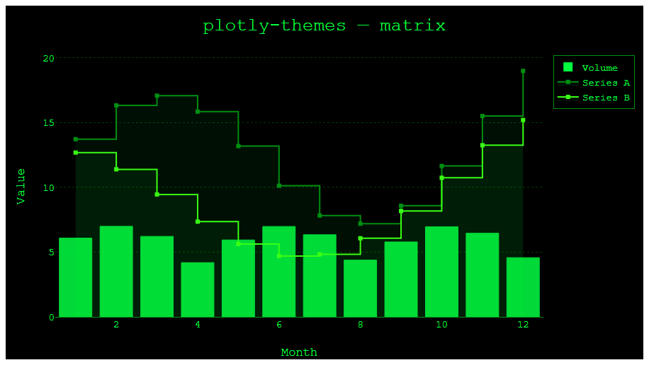 | 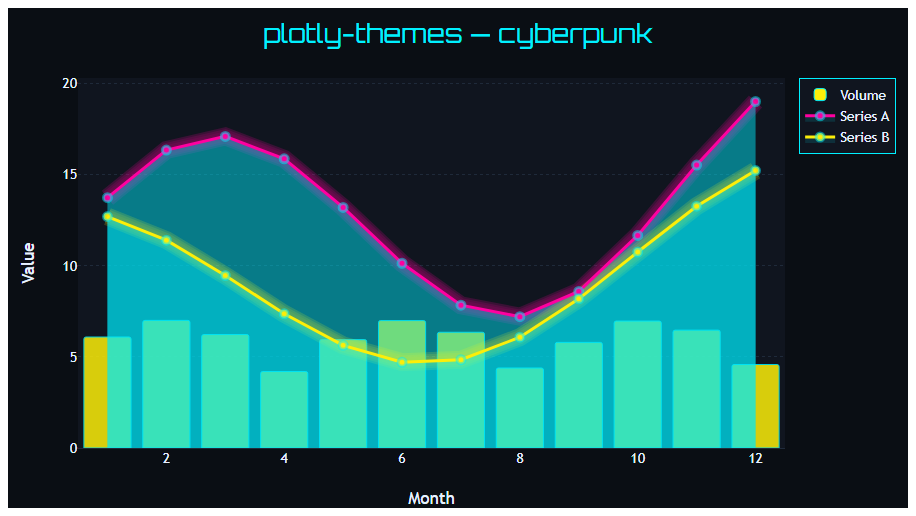 |
| **star_wars** — opening-crawl yellow, lightsaber glow | **star_trek** — 90s LCARS rounded console |
| 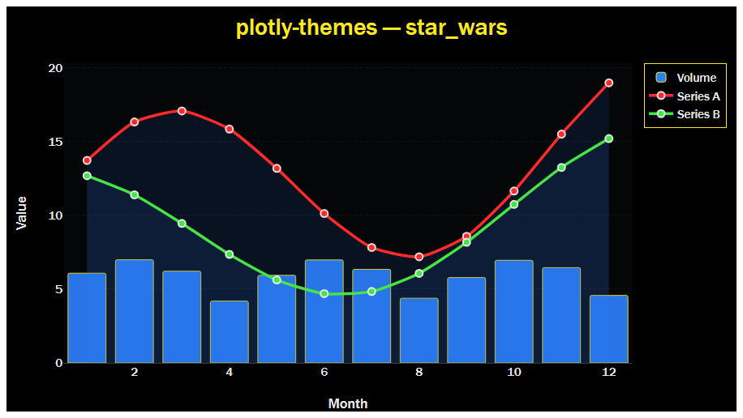 | 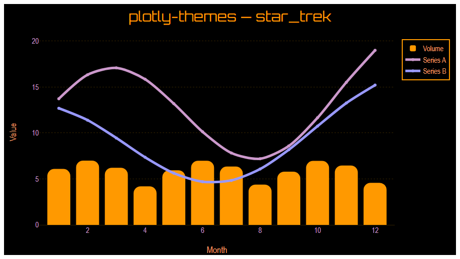 |
| **synthwave** — 80s sunset neon, dotted grid | **blueprint** — cross-hatched bars on draughting blue |
| 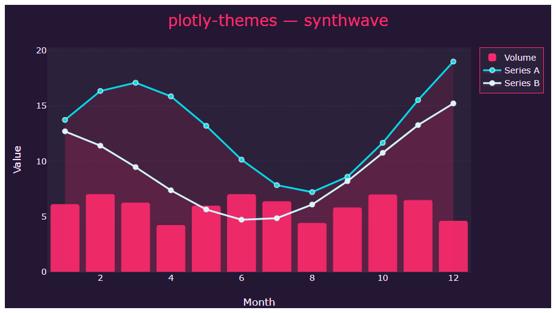 | 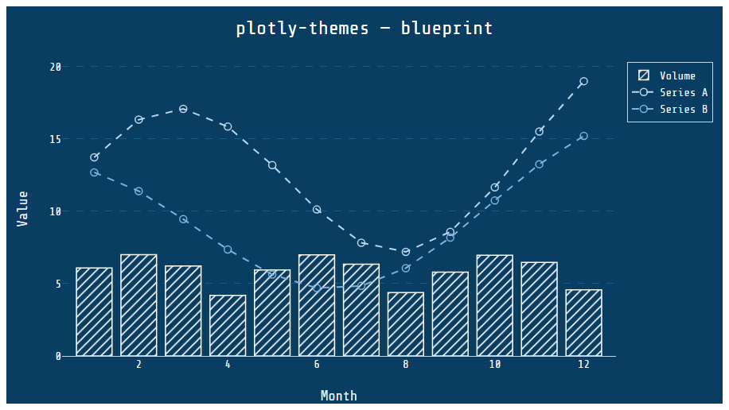 |
| **financial_times** — FT salmon paper, serif | **lego** — rounded brick bars, "stud" markers |
| 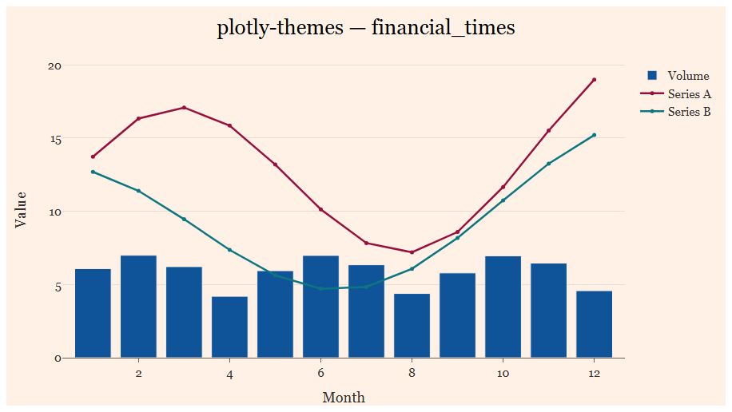 | 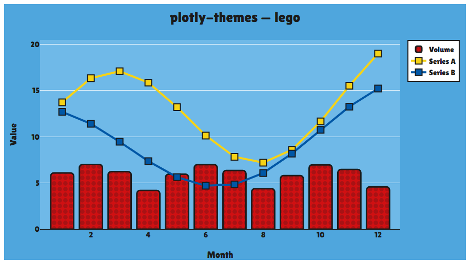 |
| **coke** — Coca-Cola ribbon splines, red wash | **barbie** — hot-pink candy bars, script title |
| 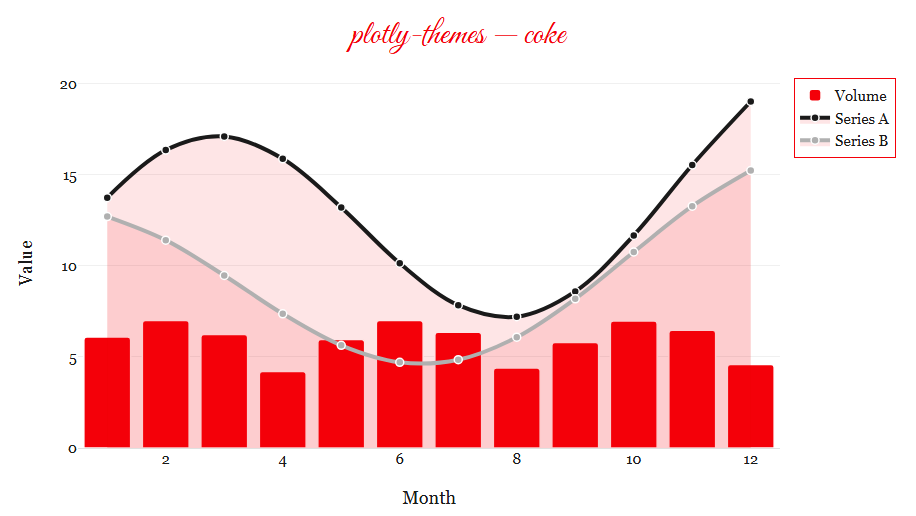 | 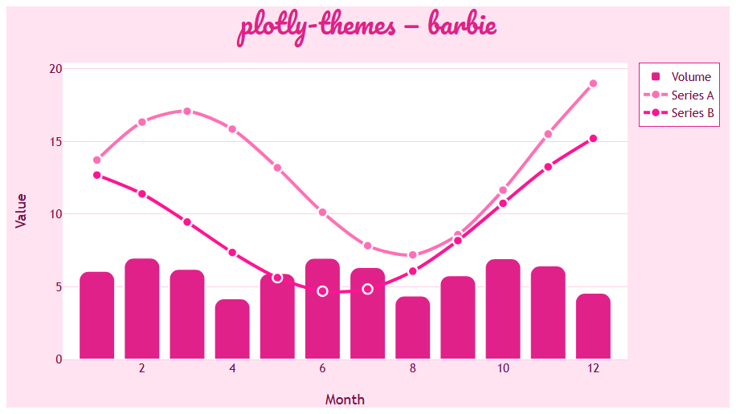 |
| **vintage_comic** — Ben-Day dots, Silver-Age inks | **xkcd** — hand-drawn comic, fat spline lines |
| 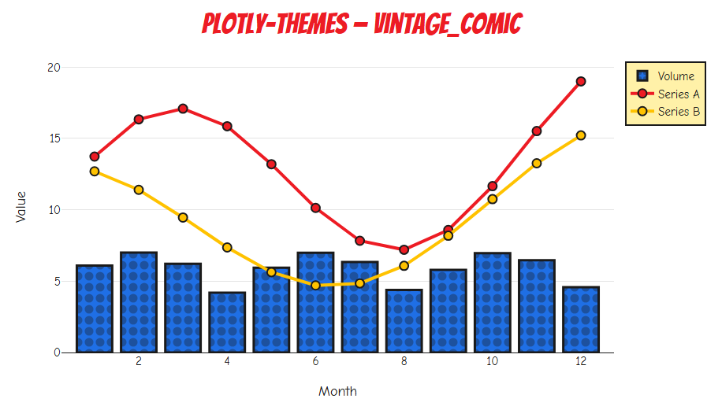 | 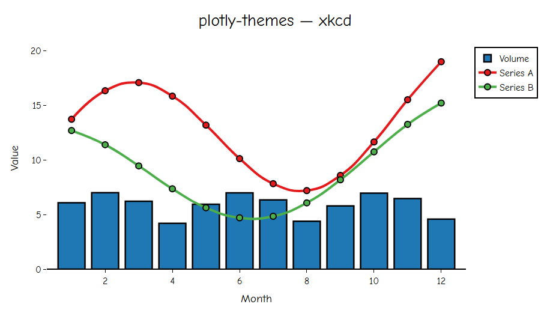 |
| **newsprint** — halftone-dot bars, newspaper serif | **minecraft** — blocky earthy palette, pixel font |
| 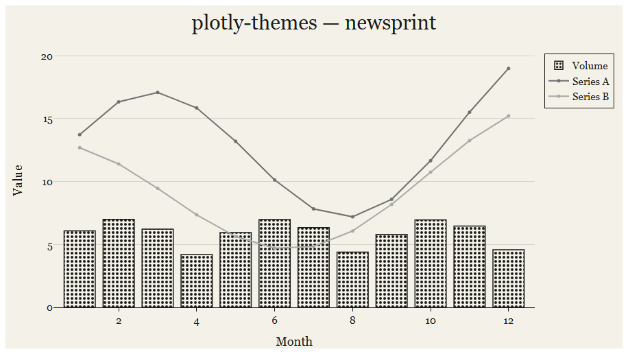 | 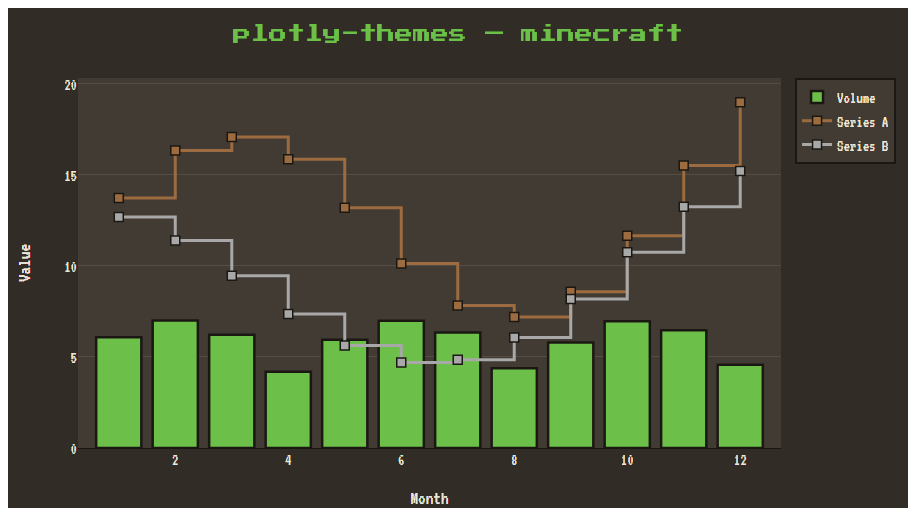 |
| **nasa** — deep-space navy, telemetry markers | **gameboy** — DMG green LCD, 8-bit pixel steps |
| 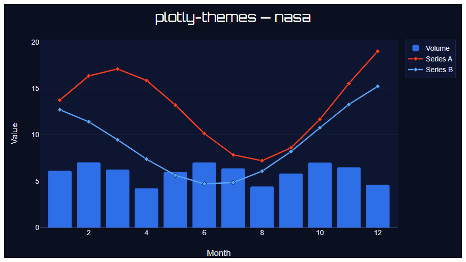 | 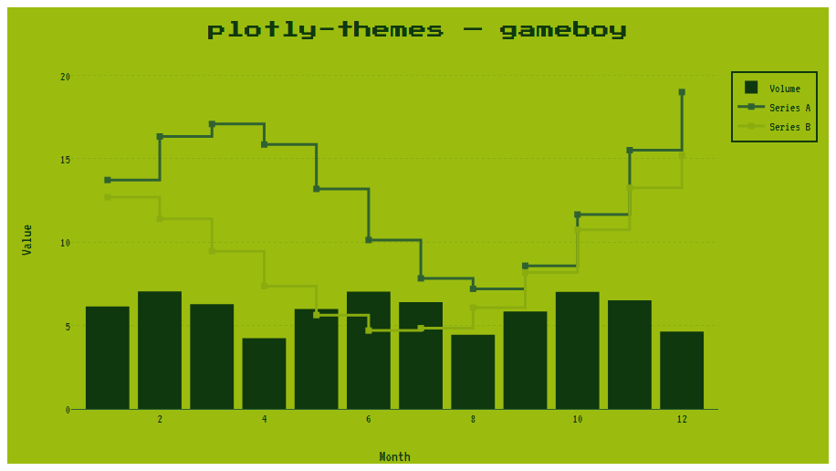 |
| **tableau** — classic Tableau 10 palette | **powerbi** — Power BI palette, rounded columns |
| 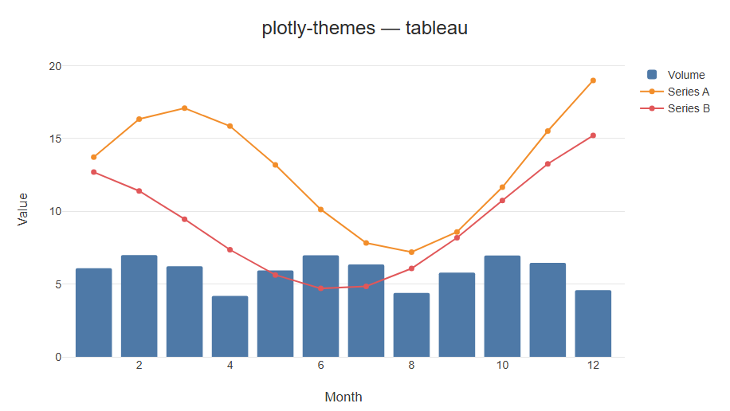 | 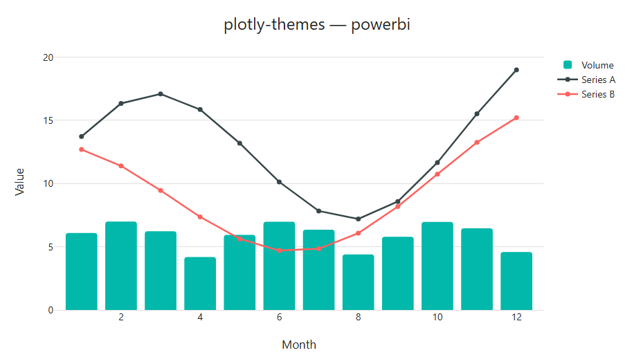 |
| **nike** — bold condensed type, value labels | **amber_terminal** — vintage amber CRT readout |
| 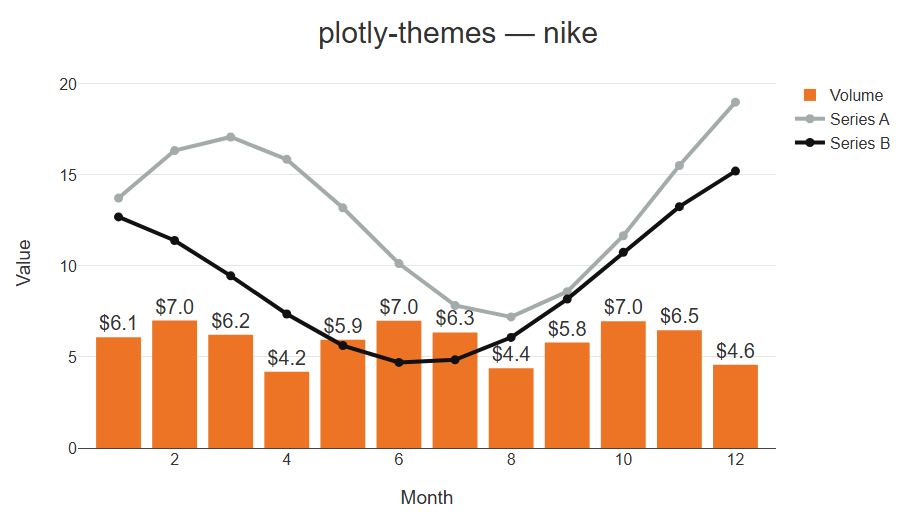 | 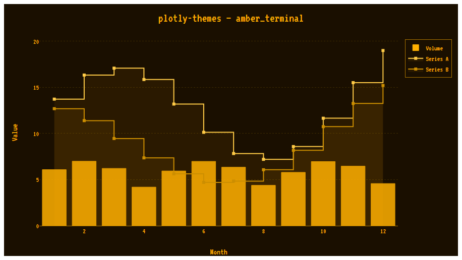 |
| **nord** — cool, muted arctic palette | **dracula** — dark slate with vivid pastels |
| 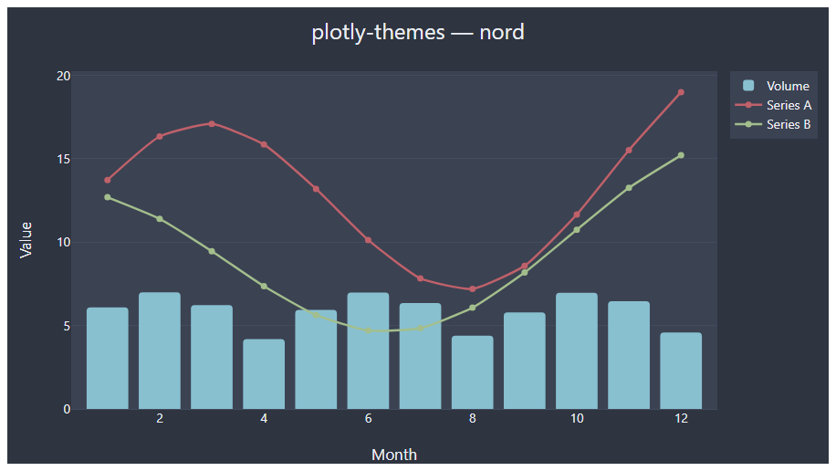 | 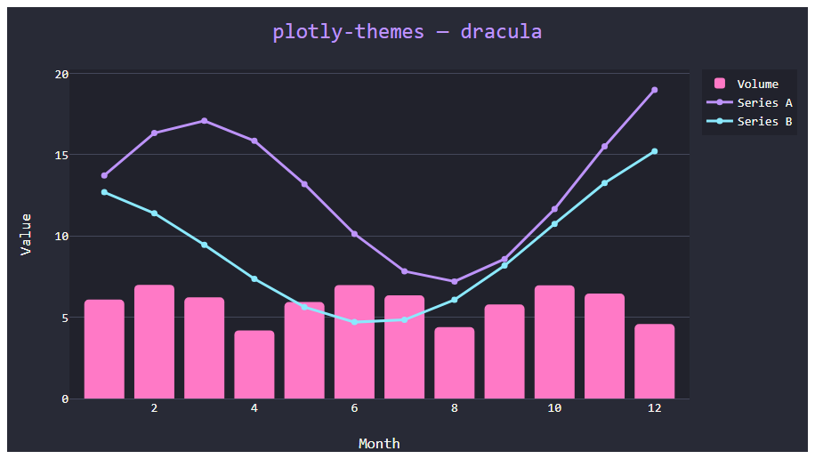 |

## Works with any chart type

The colours, fonts, colourscales, hover and legend styling apply to **all** chart
types — bar, line, scatter, pie, heatmap, histogram, box, violin, sunburst, and so
on. On import, each theme also propagates its background and axis colours to the
non-cartesian subplots (3D `scene`, `polar`/radar, `geo`/maps, `ternary`), so those
match the theme too rather than falling back to a clashing default. (Themes that
don't set a background, like `nike`, keep Plotly's defaults there.)

## Glow effect

A Plotly *template* can only set per-trace defaults — it can't add the extra
translucent traces needed for a real neon/lightsaber **glow**. So that lives in a
small helper that post-processes a figure, drawing progressively wider, fainter
copies beneath each line:

```python
import plotly_themes
import plotly.express as px

fig = px.line(df, x="t", y="v", template="star_wars")
plotly_themes.add_glow(fig)        # bloom under every line
fig.show()
```

Great with `star_wars`, `cyberpunk` and `synthwave`. Tunable via
`add_glow(fig, layers=4, width_growth=4.0, max_opacity=0.18)`.

## Custom fonts

Several themes use bundled open-source ([SIL OFL](src/plotly_themes/fonts/LICENSE-OFL.txt))
fonts — e.g. *Press Start 2P* (gameboy/minecraft), *Bangers* (vintage_comic),
*Pacifico* (barbie), *Lilita One* (a LEGO-style rounded face for lego), *Great
Vibes* (a Spencerian script for the coke title), *Orbitron*, *VT323*,
*Share Tech Mono* and *Comic Neue*. Trademarked brand fonts (the real LEGO and
Coca-Cola faces) are listed first in those themes' font stacks and used if you
have them installed, but can't be redistributed — the bundled lookalikes are the
fallback.

A figure's text is drawn by whatever displays it, so the font has to be available
to that renderer. In a notebook, register the bundled web fonts once and they'll
render without installing anything:

```python
import plotly_themes
plotly_themes.enable_fonts()       # injects @font-face into the notebook
```

`plotly_themes.font_face_css()` returns the same rules as a string for embedding
in exported HTML. For **static image export** (kaleido), install the `.ttf` files
in [`src/plotly_themes/fonts/`](src/plotly_themes/fonts/) to your OS instead, since
a headless renderer reads from the system font directories. Themes always fall
back to sensible system fonts when a bundled font isn't available.

List the themes this package registered at runtime:

```python
import plotly_themes
print(plotly_themes.registered_themes())
```

## Adding a new theme

Themes are auto-discovered, so adding one is just dropping a file into
[`src/plotly_themes/themes/`](src/plotly_themes/themes/). Each module exposes two
names:

```python
# src/plotly_themes/themes/my_theme.py
import plotly.graph_objects as go

NAME = "my_theme"                       # the key used in pio.templates
TEMPLATE = go.layout.Template(
    layout={
        "paper_bgcolor": "#101010",
        "plot_bgcolor": "#101010",
        "colorway": ["#ff0066", "#00ccff", "#ffcc00"],
        # ...
    },
)
```

That's it — `import plotly_themes` will find and register it automatically.

## Regenerating the preview images

The images above are produced by [`scripts/generate_previews.py`](scripts/generate_previews.py),
which renders a sample figure for each theme (applying `add_glow()` to the glow
themes). It uses Plotly's static image export
([kaleido](https://github.com/plotly/Kaleido)), which requires a Chrome/Chromium
install; bundled fonts must be installed to the OS to appear in these static images:

```bash
uv run python scripts/generate_previews.py
```

## License

MIT
